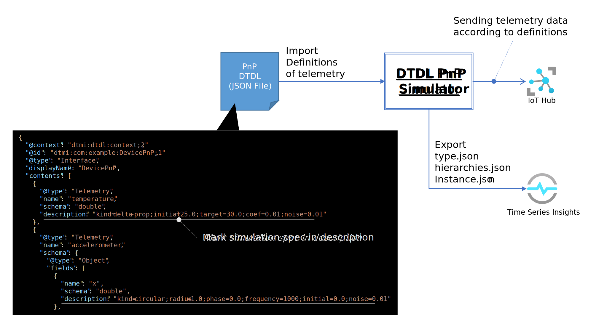
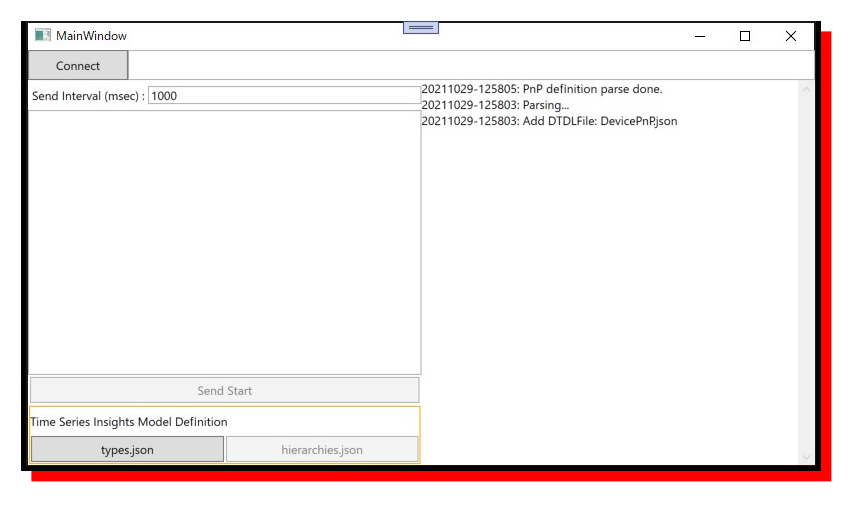
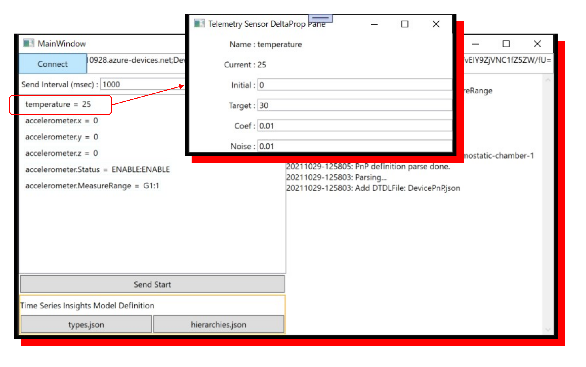
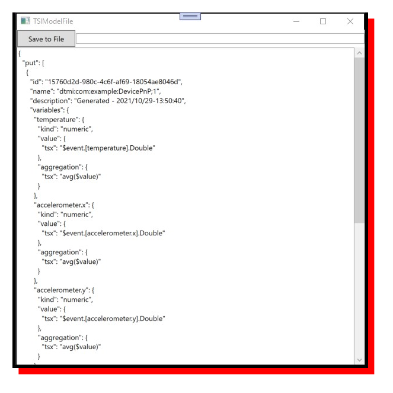
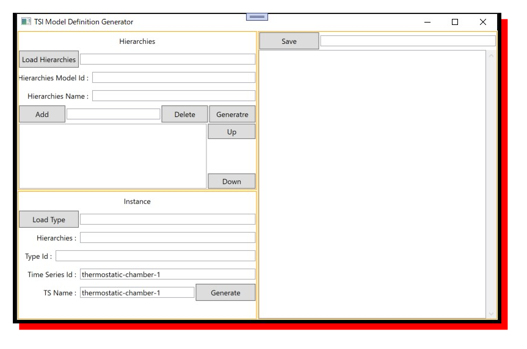
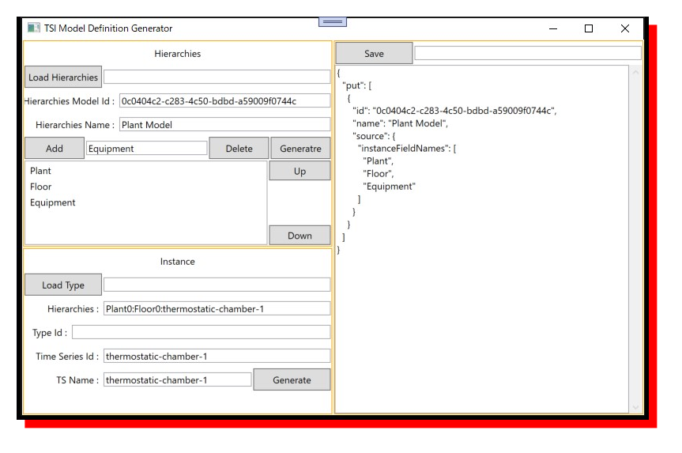
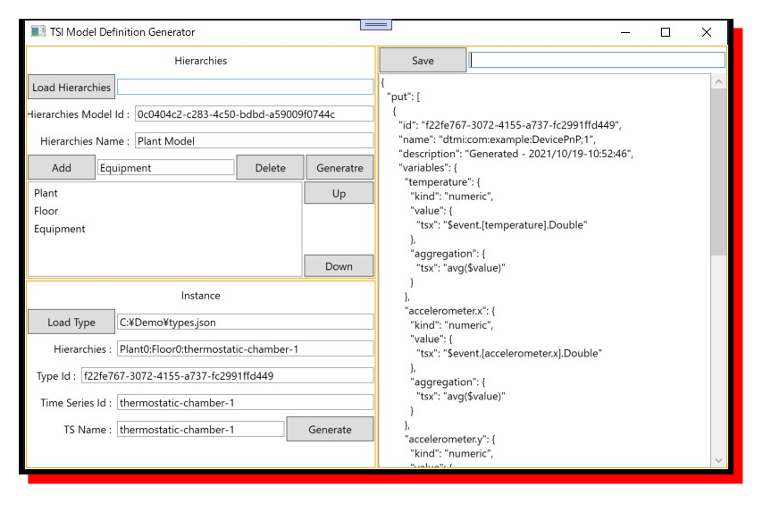

# DTDL PnP IoT Device Simulator  
  

DTDL で定義された IoT Device の Plug ＆ Play の定義をインポートして、その定義に従ってテレメトリーデータを生成し、IoT Hub に送信するシミュレータ。  
Plug ＆ Play の定義に情報を追加して、Time Series Insights にインポート可能なデータ型、階層構造、インスタンスを定義したJSONファイルを自動生成する機能も備える。  
DTDL の Telemetry 定義の description に記述を追加する事によって、データを変化させながら IoT Hub に送信する機能も備える。  

IoT Hub Plug ＆ Play の概要は、https://docs.microsoft.com/ja-jp/azure/iot-develop/overview-iot-plug-and-play を参考の事。

## Telemetry データの変化指示    
例えば、
```json
    {
      "@type": "Telemetry",
      "name": "temperature",
      "schema": "double",
      "description": "kind=delta-prop;initial=25.0;target=30.0;coef=0.01;noise=0.01"
    },
```
の様に、<b>description</b>に、'<b>;</b>'で区切った、'<b>&lt;<i>order</i>&gt;</b>=<b>&lt;<i>value</i>&gt;</b>'形式で IoT Hub に送信するデータの変化のルールを定義できる。  

### <b>kind</b>  
データの変化の種類を指定する。指定可能な <b><i>value</i></b> は以下の通り
|value|意味|指定可能な schema|
|-|-|-|
|delta-prop|初期値とターゲットを指定出来、現在値をターゲットに漸近的に近づけていく|double|
|circular|サインカーブの様な周期的な波形|double|
|discrete|固定した値|integer または double|
|timestamp|タイムスタンプであることを示す|datetime| 

<b>>kind</b>の <b><i>value</i></b> によって、';'以降に対応するルールを追加できる。  
|order|value|データ型|delta-prop|circular|discrete|備考|
|-|-|-|-|-|-|-|
|initial|初期値|double|〇|〇|〇|kindがdiscreteの時はinteger指定も可能|
|target|目標値|double|〇|×|×|delta-propの場合、現在の値とこの値の差分にcoefを乗算した値を現在値に足し、targetで指定された値に近づけていく|
|coef|目的値に近づけていくときの係数|double|〇|×|×||
|noise|ホワイトノイズ|double|〇|〇|△|各kindの現在値を更新したときに、-0.5～0.5にnoiseの値を乗算した値を現在値に加算する<br/>※kindがdiscreteの場合はdouble指定の時だけ指定可能|
|radius|半径|double|×|〇|×||
|phase|初期位相|double|×|〇|×||
|frequency|周期（msec)|double|×|〇|×||
|typename|データ型|NA|×|×|〇|integer または double|

シミュレータは起動時に DTDL（JSONファイル） の Plug ＆ Play で定義されたルールを読み込み、そのルールに従い、シミュレータの GUI で指定可能な時間間隔（msec単位）で、現在値を計算し、IoT Hub に JSON データを送信する。  
それぞれの<b>kind</b>の定義は以下の通り。  
#### delta-prop  
目標値に漸近的に近づいていく物理変数をシミュレートする。シミュレーション開始時点の値は、<b>initial</b>で指定した値である。時間間隔で指定された時点毎に以下の計算を行い、現在値（<b>current</b>）を更新する。  
```
current = current + (target-current) × coef + (0.5 - rand) × noise
```
※ <b>rand</b> は、0.0 から 1.0 未満の乱数

#### circular  
周期的に変化する物理変数をシミュレートする。シミュレーション開始時点の値は、<b>initial</b>で指定した値である。シミュレーション開始時点の Tick 数(Ti)を記録しておき、時間間隔で指定された時点毎の Tick 数(Tu)を元に以下の計算を行い、現在値（<b>current</b>）を更新する。  
```
current = initial + sin((Tu-Ti) % frequency + phase) + (0.5 - rand) × noise
```

#### discrete  
値が変わらない、もしくは、同一の値にホワイトノイズが加えられた値を現在値とする。  
<b>typename</b> を <b>integer</b> にした時は固定値、<b>double</b> にした時は、<b>noise</b> でノイズをのせることができる。この場合は、  
```
current = initial + (0.5 - rand) × noise
```
となる。  

### 列挙型(Enum)  
Enum による Plug ＆ Play 定義も対応可能。  
```json
          {
            "name": "Status",
            "schema": {
              "@type": "Enum",
              "valueSchema": "string",
              "enumValues": [
                {"name": "ENABLE","enumValue": "ENABLE", "description": "initial=true"},
                {"name": "DISABLE","enumValue": "DISABLE"}
              ]            }
          },
```
<b>enumValues</b> の項目の <b>description</b> に <b>initial=true</b> と書けば、その値が IoT Hub に送信される。<b>valueSchema</b> が <b>string</b> の場合は、IoT Hub に送信される JSON メッセージにおいても文字列として送信される。  
```json
"Status":"ENABLE"
```
<b>valueSchema</b> が <b>integer</b> の場合は数値で送られる。  
```json
"MeasureRange": 1
```

### Object 型  
Object による Plug ＆ Play 定義の場合は、構造をもった JSON メッセージが送信される。例えば、  
```json
    {
      "@type": "Telemetry",
      "name": "accelerometer",
      "schema": {
        "@type": "Object",
        "fields": [
          {
            "name": "x",
            "schema": "double",
            "description": "kind=circular;radius=1.0;phase=0.0;frequency=1000;initial=0.0;noise=0.01"
          },
          {
            "name": "y",
            "schema": "double",
            "description": "kind=circular;radius=1.0;phase=pi/2;frequency=1000;initial=0.0;noise=0.01"
          },
          {
            "name": "z",
            "schema": "double",
            "description": "kind=circular;radius=1.0;phase=0.5*pi;frequency=1000;initial=0.0;noise=0.01"
          },
          {
            "name": "Status",
            "schema": {
              "@type": "Enum",
              "valueSchema": "string",
              "enumValues": [
                {"name": "ENABLE","enumValue": "ENABLE", "description": "initial=true"},
                {"name": "DISABLE","enumValue": "DISABLE"}
              ]            }
          },
          {
            "name":"MeasureRange",
            "schema": {
              "@type": "Enum",
              "valueSchema": "integer",
              "enumValues": [
                {"name": "G1", "enumValue": 1, "description": "initial=true"},
                {"name": "G2", "enumValue": 2},
                {"name": "G4", "enumValue": 4}
              ]
            }
          }
        ]
      }
    },
```
の様な DTDL 定義の場合、
```
"accelerometer": {
    "x": 0.453,
    "y": -2.71,
    "z": 0.128,
    "Status": "ENABLE",
    "MeasureRange": 1
}
```
というような形式の JSON メッセージが送信される。  
Object 型を入れ子にした定義も可能であり、更に階層化されれたメッセージが送信される。  

## サンプルアプリの実行  
Visual Studio 2019 で、[WpfAppIoTDeviceSimulator](./WpfAppIoTDeviceSimulator) の [WpfAppIoTDeviceSimulator.sln](WpfAppIoTDeviceSimulator/WpfAppIoTDeviceSimulator.sln) を開き、Build して実行する。  
  
アプリの起動中に、[WpfAppIoTDeviceSimulator/WpfAppIoTDeviceSimulator/](WpfAppIoTDeviceSimulator/WpfAppIoTDeviceSimulator)の、[models/pnp/DevicePnP.json](WpfAppIoTDeviceSimulator/models/pnp/DevicePnP.json)が読み込まれ、Telemetry プロパティと前述のルールを読み込む。  
IoT Hub に IoT Device を対称キー認証で作成し、その接続文字列を "Connect" の右のテキストボックスにコピペし、"Connect"ボタンをクリックすると、IoT Hub に登録した IoT Device として接続される。  
IoT Hub への接続が確立するとボタンが Enable になるので、"Send Start"をクリックして IoT Hub への送信を開始する。  
また、接続が確立すると、DevicePnP.json で定義された Telemetry パラメータがリスト表示される。リスト表示された項目を選択すると、各 Telemetry パラメータのルール設定を変更できる。  
  
また、"Send Interval(msec)"は、1000 msec になっている。この時間間隔も変更可能である。  

### Time Series Insights へのインポート用ファイルの生成  
左下の "types.json" をクリックすると、Time Series Insights Environment にインポート可能なデータ型定義 JSON ファイルが生成される。  


"hierarchies.json" をクリックすると、階層構造とインスタンス定義を生成するパネルが表示される。  
  
先ず、左上の、"Hierarchies"の"Hiearchies Model Id"に、UUID 等の一意が保証される文字列を入力し、"Hiearchies Name" に階層モデルの名前を入力する。  
"Add" ボタンの左隣のテキストボックスに各階層の名前を入力し、"Add"ボタンをクリックすると、各階層が上から順番に下のリストボックスに表示され定義できる。例えば、"Plant"、"Floor"、”Equipment"といった様に順番に入力していく。入力済みの階層は、リスト上で選択し、"Delete" をクリックすると削除され、"Up"、"Down"で上位あるいは下位に移動できる。  
一通り入力が終わったら、"Generate"をクリックする。右側のテキストボックスに Time Series Insights で入力可能な Hierarchies.jsonが生成されて表示されるので、"Save"をクリックしてファイルに保存する。  
また、生成済みの Hierarchies.jsonは、"Load Hierarchies"をクリックしてファイルを選択する事により読込み可能である。  



次に、左下の、"Instance"で、"Load Type" をクリックして、メインパネル側の"type.json"ボタンで生成したデータ型定義のtype.jsonを読み込む。"Hiearchies" のテキストボックスには、上の Hierarchies で定義した階層名に相当する実際の名前を":"で区切って入力する。  
例えば、"Plant"、"Floor"、”Equipment"と Hierarchies の方で定義したとすると、
```
Plant0:Floor0:Equipment0
```  
といった様に定義する。設定が終わったら、"Generate" ボタンをクリックし保存する。  


Time Series Insights の階層モデル定義については、https://docs.microsoft.com/ja-jp/azure/time-series-insights/concepts-model-overview を参照の事。  
